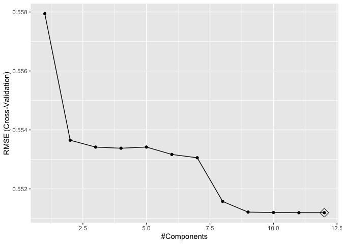
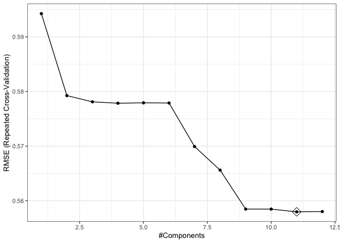

p8106_midterm_qh2285
================
Qianxuan Huang
2025-03-27

``` r
library(caret)
library(glmnet)
library(tidyverse)
```

## training data cleanning

``` r
load("dat1.RData")
training_data <- dat1 %>%
  select(-id) %>% 
  drop_na() 
```

## elastic net

Use ‘caret’ package for the elastic net model. The reason to choose
lambda from -10 to -2 is because that for a larger value it shows
“Warning: There were missing values in resampled performance measures”.
And this range is resonable becauset covers the range from stronger
regularization exp(-1) ≈ 0.3679 to weaker regularization exp(-6) ≈
0.002478. The result is that alpha=0.2, lambda=0.002478752.

``` r
#for 10 fold cross viadiation 
ctrl1 <- trainControl(method = "cv", number = 10)

set.seed(2025)
enet.fit <- train(log_antibody ~ .,
                  data = training_data,
                  method = "glmnet",
                  preProcess = NULL, 
                  standardize = FALSE,
                  tuneGrid = expand.grid(alpha = seq(0, 1, length = 21), 
                                         lambda = exp(seq(-1, -6, length = 100))),
                  trControl = ctrl1)

#select alpha and lambda
enet.fit$bestTune
```

    ##     alpha      lambda
    ## 401   0.2 0.002478752

## PLS

There are 12 components are included in the model, which means all
variables are included.

``` r
#create matrix of predictors (glmnet uses input matrix)
x <- model.matrix(log_antibody ~ ., training_data)[,-1] 
# vector of response
y <- training_data[, "log_antibody"]

ctrl1 <- trainControl(method = "cv", number = 10)
set.seed(2)
pls_fit <- train(x, y,
                 method = "pls",
                 tuneGrid = data.frame(ncomp = 1:12),
                 trControl = ctrl1,
                 preProcess = c("center", "scale"))


# get the number of coefficients
pls_fit$bestTune
```

    ##    ncomp
    ## 12    12

``` r
ggplot(pls_fit, highlight = TRUE)
```

<!-- -->

## PCR

There are 11 components are included in the model, which one variable is
excluded.

``` r
ctrl1 <- trainControl(method = "repeatedcv", 
                      number = 10,
                      repeats = 5,
                      selectionFunction = "best")

set.seed(2)
pcr_fit <- train(x, y,
                 method = "pcr",
                 tuneGrid  = data.frame(ncomp = 1:12),
                 trControl = ctrl1,
                 preProcess = c("center", "scale"))

# get the number of coefficients
pcr_fit$bestTune
```

    ##    ncomp
    ## 11    11

``` r
ggplot(pcr_fit, highlight = TRUE) + theme_bw()
```

<!-- -->
